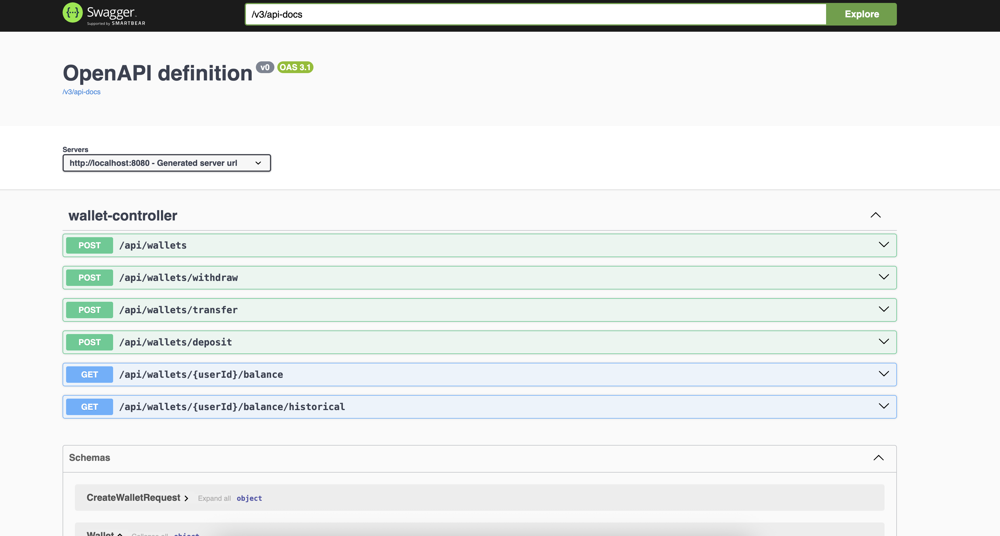

# Wallet Service

A microservice for managing user wallets with support for deposits, withdrawals, and transfers between users.

## Overview

This wallet service provides a RESTful API for financial operations including wallet creation, balance retrieval, fund deposits, withdrawals, and transfers. The service is designed with production-grade reliability, auditability, and data consistency in mind.

## Features

- **Create Wallet**: Create new wallets for users
- **Retrieve Balance**: Get current wallet balance
- **Retrieve Historical Balance**: Get wallet balance at a specific point in time
- **Deposit Funds**: Add money to a wallet
- **Withdraw Funds**: Remove money from a wallet (with balance validation)
- **Transfer Funds**: Move money between user wallets

## Technology Stack

- **Java 21(LTS)** - Programming language
- **Spring Boot 3.x** - Application framework
- **Spring Data JPA** - Data persistence
- **PostgreSQL** - Production database
- **Liquibase** - Database migrations
- **H2 Database** - In-memory database (testing)
- **JUnit 5** - Unit testing
- **Mockito** - Mocking framework for tests
- **Spring MockMvc** - Integration testing
- **RESTful API** - JSON over HTTP
- **Maven** - Build tool
- **Docker** - Containerization

## Architecture

The service follows a layered architecture:

- **Controller Layer**: REST endpoints for wallet operations
- **Service Layer**: Business logic and transaction management
- **Repository Layer**: Data access and persistence
- **Entity Layer**: Data models (Wallet, Transaction)

### Key Design Decisions

1. **Transaction Logging**: Every operation creates a transaction record for full auditability
2. **Pessimistic Locking**: Uses database-level locking to prevent race conditions
3. **Balance Calculation**: Balances are stored and updated atomically to ensure consistency
4. **Historical Balance**: Calculated from transaction history at specific timestamps
5. **Error Handling**: Comprehensive validation and meaningful error responses

6. **Idempotency Support**: Uses idempotency keys to prevent duplicate transaction processing
## Database Schema

### Wallet Table
- `id`: Primary key
- `user_id`: Unique user identifier
- `balance`: Current wallet balance
- `created_at`: Wallet creation timestamp
- `updated_at`: Last modification timestamp

### Transaction Table
- `id`: Primary key
- `user_id`: User identifier
- `type`: Transaction type (DEPOSIT, WITHDRAWAL, TRANSFER_IN, TRANSFER_OUT)
- `amount`: Transaction amount
- `balance_before`: Balance before transaction
- `balance_after`: Balance after transaction
- `description`: Transaction description
- `created_at`: Transaction timestamp

### Idempotency Key Table
- `key`: Primary key (idempotency key string)
- `user_id`: User identifier
- `operation`: Operation type (DEPOSIT, WITHDRAWAL, TRANSFER_OUT)
- `reference_id`: Reference to the transaction ID
- `created_at`: Record creation timestamp

## API Endpoints

### Create Wallet
```
POST /api/wallets
Content-Type: application/json

{
  "userId": "user123"
}
```

### Get Current Balance
```
GET /api/wallets/{userId}/balance
```

### Get Historical Balance
```
GET /api/wallets/{userId}/balance/historical?timestamp=2024-01-15T10:30:00
```

### Deposit Funds
```
POST /api/wallets/deposit
Content-Type: application/json
Idempotency-Key: deposit-123e4567-e89b-12d3-a456-426614174000

{
  "userId": "user123",
  "amount": 100.50,
  "description": "Salary deposit"
}
```

### Withdraw Funds
```
POST /api/wallets/withdraw
Content-Type: application/json
Idempotency-Key: withdraw-987fcdeb-51a2-43d7-8b9e-123456789abc

{
  "userId": "user123",
  "amount": 50.00,
  "description": "ATM withdrawal"
}
```

### Transfer Funds
```
POST /api/wallets/transfer
Content-Type: application/json
Idempotency-Key: transfer-456789ab-cdef-1234-5678-90abcdef1234

{
  "fromUserId": "user123",
  "toUserId": "user456",
  "amount": 75.00,
  "description": "Payment to friend"
}
```

## Idempotency

The service supports idempotency for all financial operations (deposit, withdraw, transfer) to prevent duplicate transaction processing. This is crucial for financial systems where duplicate operations can cause serious issues.

### How It Works

1. **Idempotency-Key Header**: Include an `Idempotency-Key` header in your requests for deposit, withdraw, and transfer operations
2. **Unique Keys**: Each idempotency key should be unique per user and operation type
3. **Duplicate Detection**: If the same key is used again, the service returns the original transaction instead of creating a new one
4. **Atomic Operations**: The idempotency check and transaction creation happen in the same database transaction

### Key Format Recommendations

- Use UUIDs or similar unique identifiers
- Include operation type prefix for clarity (e.g., `deposit-`, `withdraw-`, `transfer-`)
- Example: `deposit-123e4567-e89b-12d3-a456-426614174000`

### Behavior

- **First Request**: Transaction is processed normally and idempotency key is stored
- **Duplicate Request**: Returns the existing transaction details without creating a new transaction
- **Different User**: Same idempotency key can be used by different users (scoped per user)
- **Different Operation**: Same key can be used for different operation types

### Error Handling

If a duplicate idempotency key is detected, the service will return a `409 Conflict` status with the original transaction details, ensuring clients can handle retries gracefully.

## API Documentation: Swagger/OpenAPI

The API is documented using Swagger. Once the application is running, access the documentation at:
```
http://localhost:8080/swagger-ui/index.html
```



## Installation and Setup

### Prerequisites
- Java 21
- Maven 3.6+
- Docker

### Running Locally

1. **Clone the repository**
```bash
git clone https://github.com/fabio-siqueira/wallet.git
cd wallet
```

2. **Build the application**
```bash
mvn clean compile
```

3. **Run tests**
```bash
mvn test
```

4. **Start the application**
```bash
mvn spring-boot:run
```

The service will start on `http://localhost:8080`

### Running with Docker Compose
1. **Ensure Docker and Docker Compose are installed**
2. **Run the following command**
```bash
  docker-compose -p wallet up --build -d 
```
The service will be available at `http://localhost:8080`

### Running with Docker

1. **Build the Docker image**
```bash
  docker build -t wallet-service .
```

2. **Run the container**
```bash
  docker run -p 8080:8080 wallet-service
```

### Database Configuration

For production, update `application.yml` with PostgreSQL configuration:

```yaml
spring:
  datasource:
    url: jdbc:postgresql://localhost:5432/wallet
    username: ${DB_USERNAME}
    password: ${DB_PASSWORD}
  jpa:
    hibernate:
      ddl-auto: validate
    database-platform: org.hibernate.dialect.PostgreSQLDialect
```

## Testing

The project includes comprehensive test coverage:

- **Unit Tests**: Service layer business logic
- **Integration Tests**: Full API endpoint testing
- **Repository Tests**: Data access layer validation

Run all tests:
```bash
  mvn test
```

Run integration tests only:
```bash
  mvn test -Dtest=*IntegrationTest
```

## Design Rationale

### Meeting Functional Requirements

1. **Wallet Creation**: Simple user-wallet mapping with uniqueness constraints
2. **Balance Retrieval**: Direct database queries with proper error handling
3. **Historical Balance**: Transaction-based calculation for point-in-time accuracy
4. **Deposits/Withdrawals**: Atomic operations with transaction logging
5. **Transfers**: Two-phase transaction with proper rollback handling

### Meeting Non-Functional Requirements

1. **Mission-Critical Reliability**:
    - Database transactions ensure data consistency
    - Pessimistic locking prevents race conditions
    - Comprehensive error handling and validation
    - Health checks for monitoring

2. **Full Traceability**:
    - Every operation creates an audit trail
    - Transaction records include before/after balances
    - Timestamps for all operations
    - Descriptive transaction types and descriptions

### Assumptions Made

1. **User Management**: Users exist externally; service only manages wallets
2. **Currency**: Single currency system (no multi-currency support)
3. **Precision**: Two decimal places for monetary amounts
4. **Concurrency**: High concurrency expected, hence pessimistic locking
5. **Validation**: Basic validation only (e.g., positive amounts, existing users)

## Trade-offs and Compromises

### Due to Time Constraints

1. **Authentication/Authorization**: Not implemented - would require JWT/OAuth integration
2. **Rate Limiting**: Not implemented - would prevent abuse and DoS attacks
3. **Caching**: Not implemented - Redis caching would improve performance
4. **Monitoring**: Basic health checks only - would add metrics and alerting
5. **Load Testing**: Not performed - would ensure performance under stress
6. **Deployment Automation**: Manual deployment - would benefit from CI/CD pipelines
7. **Logging**: Basic logging - would benefit from structured logging and log aggregation
8. **Internationalization**: Not considered - would benefit from multi-language support
9. **Documentation**: Limited documentation - would benefit from detailed API docs and usage guides
10. **Extensibility**: Basic design - would benefit from a more modular architecture for future features
11. **Testing Coverage**: Focused on core functionality - would benefit from more edge case tests and performance tests

### Technical Trade-offs

1. **Database Choice**: H2 for simplicity vs PostgreSQL for production
2. **Locking Strategy**: Pessimistic locking for consistency vs optimistic for performance
3. **Balance Storage**: Denormalized balance vs calculated from transactions

## Production Considerations

For production deployment, consider:

1. **Connection Pooling**: Configure HikariCP for optimal database performance
3. **Monitoring**: Add application metrics and health dashboards
4. **Security**: Implement authentication, authorization, and input sanitization
5. **Load Balancing**: Deploy multiple instances behind a load balancer
6. **Backup Strategy**: Implement regular database backups and recovery procedures

## Development Time

Estimated time investment: **7 hours**

- Initial setup and configuration: 1 hour
- Core business logic implementation: 3 hours
- Database design and repository layer: 1.5 hours
- REST API and controllers: 1 hour
- Testing and validation: 1.5 hours